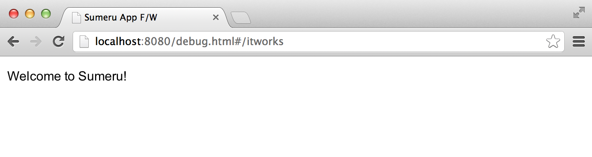
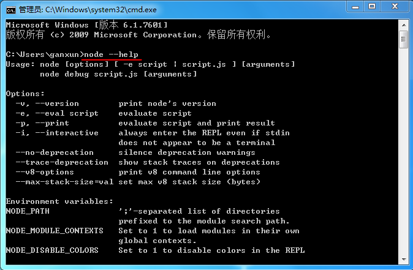
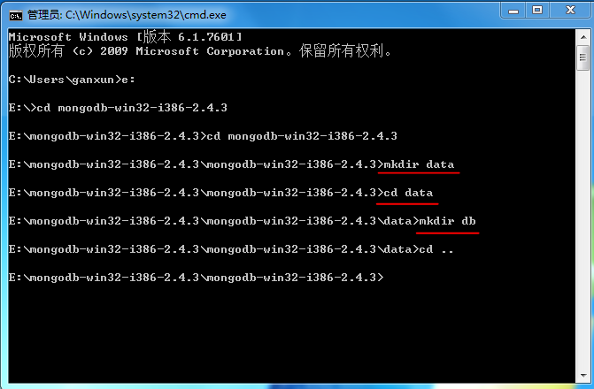
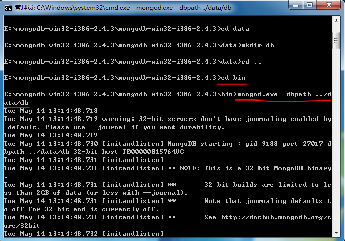

##如何安装和运行Clouda

### 安装

Clouda是基于node.js的Webapp开发框架，在使用Clouda时需要安装**node.js**和**mongoDB**，如果您没有安装请参考本文档结尾处(环境搭建)。

	npm install -g sumeru
	
### 使用Clouda创建工程

	sumeru init ./myproject
	
### 运行Clouda

**在运行Clouda前需要启动mongoDB并保持在后台运行**

	cd myproject
	
	sumeru start

##查看Clouda框架中的实例（itworks）

在运行应用之前，请确保已经安装并启动mongoDB并保持在后台运行，然后在浏览器中输入 localhost:8080/debug.html#/itworks 第一次运行Clouda。

## 环境搭建

### 安装node.js

sumeru是基于node.js的开发框架，所以我们首先需要安装node.js

* 下载node.js，地址：<http://nodejs.org/download/>

* 安装node.js

* 启动cmd.exe，并在命令行中输入

		node --help
		
	
	
	出现上图所示，表明node.js已经安装成功。

### 安装mongoDB

在本地sumeru已mongoDB作为数据库，按照下面的步骤安装并启动mongDB

* 下载mongoDB，地址：<http://www.mongodb.org/downloads>

* 解压下载的文件夹

* 启动cmd.exe，进入解压后的目录，在根目录下创建"data"目录，并在创建的"data"目录下创建"db"文件夹

* 进入根目录下的bin/，启动mongodb

		mongod.exe -dbpath ../data/db	
		

** 注意： 在运行sumeru应用前必须启动mongoDB并运行在后台 **
